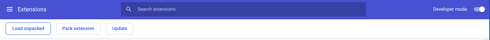
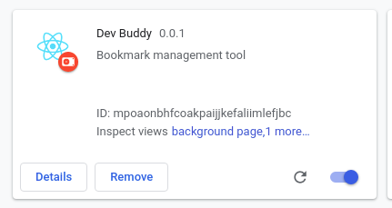
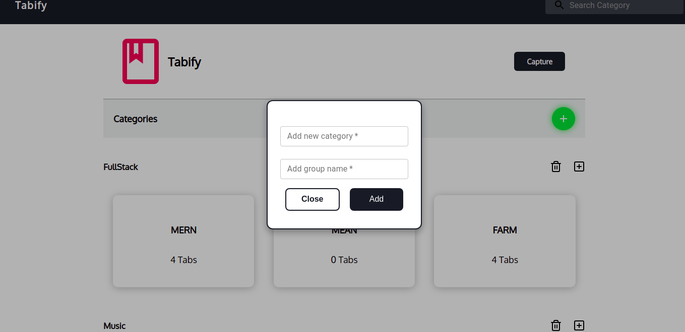
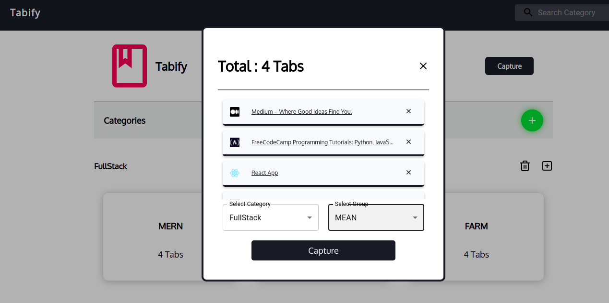
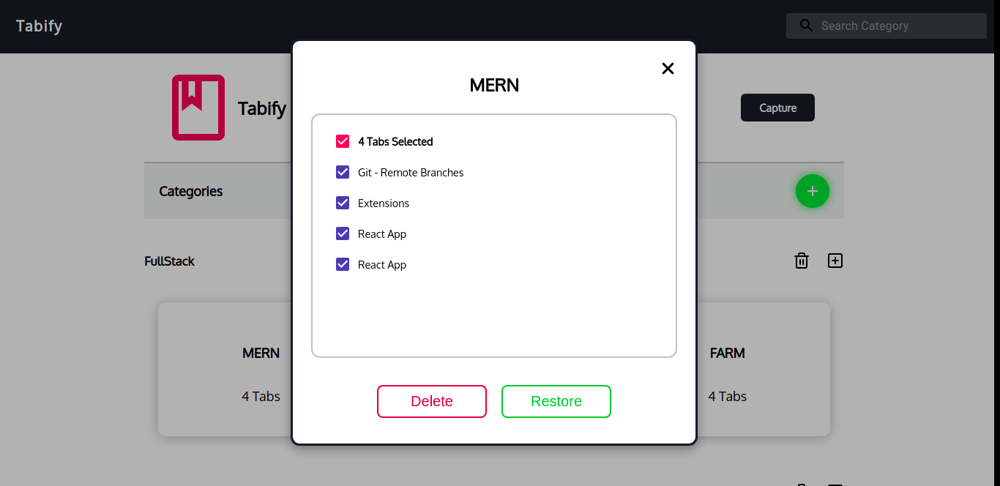

# Tabify


## Description
This is a Chrome Extension developer tools for capturing the current window tabs and for saving them in categories based on their purpose of opening.


## Demo


https://user-images.githubusercontent.com/45001916/129273905-8904fe43-aa74-4edf-9809-12577fd9103f.mp4


## Installation
Navigate to chrome extension page `extension link` or search for Tabify in chrome web store. Install then you are good to go.

### Getting Started
To run locally on your system

`$ git clone https://github.com/MLH-Fellowship/pod-3.1.0-DevBuddy.git`

`$ cd app/`

` $ yarn install  ` 

`$ yarn build`

Navigate to `chrome://extensions` then enable the developer mode from the far right.
- Click on load unpacked on the far left



- locate the build folder in the project section and click add and you will get below image in your extenstion list



Locate DevBuddy from the list of available extensions and click on it to open up the extension.

## Credit
@grace-omotoso
@tomarviii88 
@shweta3047
@netman5
@#3Tushar3099 

## Usage
DevBuddy assist in tab organisation, using **Category** for collecting tabs that are related together and **Group** for collating tabs that are opened for similar purpose. 

#### Functionalities: 

- **Add Categories**

This function allow adding of new category and group name for tabs to be capture.



- **Capture**

This feature capture the current browser window tabs with option to select category and groups based on currently available categories and group.



- **Tabs Group**

The tabs group feature when clicked popup a modal for 
- for selection of the list of saved tab urls with title
- options to either delete or restore tabs base on preference.
- option to delete entire tab group



- **Icon delete to category**
  
To remove entire category with categories 

- **Icon to add group to existing category**

To add group to an existing category
## Contributing
Pull requests are welcome. For major changes, please open an issue first to discuss what you would like to change.

Please make sure to update tests as appropriate.

### Useful commands
Fork the project

Switch branches:
```
git checkout <branch-name>
```

Make new branch and switch to it:
```
git checkout -b <branch-name>
```

I'd recommend using the GitHub CLI for reviewing Pull Requests, making Pull Requests and making Issues.
## License
[MIT](https://choosealicense.com/licenses/mit/)
